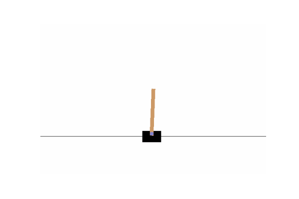

# Cartpole DQN

This repo contains a jupyter notebook example of a simple DQN used to learn on the OpenAI cartpole game.

## DQN

## Result

## License
[MIT](https://choosealicense.com/licenses/mit/)